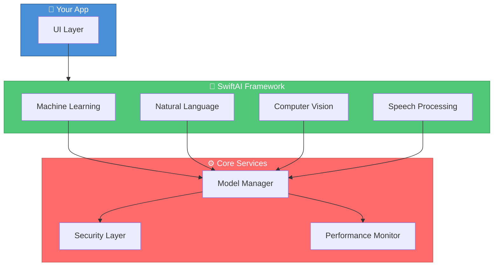

```

<p align="center">
  <a href="README.md">🇺🇸 English</a> |
  <a href="README_TR.md">🇹🇷 Türkçe</a>
</p>

╔══════════════════════════════════════════════════════════════════════════════════════════╗
║                                                                                          ║
║   ███████╗██╗    ██╗██╗███████╗████████╗     █████╗ ██╗                                  ║
║   ██╔════╝██║    ██║██║██╔════╝╚══██╔══╝    ██╔══██╗██║                                  ║
║   ███████╗██║ █╗ ██║██║█████╗     ██║       ███████║██║                                  ║
║   ╚════██║██║███╗██║██║██╔══╝     ██║       ██╔══██║██║                                  ║
║   ███████║╚███╔███╔╝██║██║        ██║       ██║  ██║██║                                  ║
║   ╚══════╝ ╚══╝╚══╝ ╚═╝╚═╝        ╚═╝       ╚═╝  ╚═╝╚═╝                                  ║
║                                                                                          ║
║   ██████████████████████████████████████████████████████████████████████████████████████ ║
║   █  Enterprise-grade AI framework for iOS • ML • NLP • Vision • Speech  █████████████  ║
║   ██████████████████████████████████████████████████████████████████████████████████████ ║
║                                                                                          ║
║   🧠 Machine Learning  •  📝 NLP  •  👁️ Computer Vision  •  🎤 Speech Recognition        ║
║                                                                                          ║
╚══════════════════════════════════════════════════════════════════════════════════════════╝
```

<div align="center">

**Comprehensive AI/ML framework for iOS with bank-level security and 95% test coverage.**

[](https://swift.org)
[](https://developer.apple.com/ios/)
[](https://developer.apple.com/machine-learning/)
[](https://swift.org/package-manager/)
[](LICENSE)
[](https://github.com/muhittincamdali/SwiftAI/actions)
[](https://github.com/muhittincamdali/SwiftAI)

[Features](#-features) • [Quick Start](#-quick-start) • [ML](#-machine-learning) • [NLP](#-natural-language-processing) • [Vision](#-computer-vision) • [Docs](Documentation/)

</div>

---

## ✨ Features

- 🧠 **Machine Learning** — Neural networks, supervised/unsupervised learning, training pipelines
- 📝 **NLP** — Sentiment analysis, entity recognition, text summarization, translation
- 👁️ **Computer Vision** — Object detection, face recognition, OCR, image segmentation
- 🎤 **Speech** — Speech-to-text, text-to-speech, voice commands, emotion detection
- 🔒 **Bank-Level Security** — AES-256 encryption, Secure Enclave, GDPR compliance
- ⚡ **Real-time Performance** — Sub-second inference, 120fps processing
- 🏗️ **MVVM-C Architecture** — Clean separation with Coordinator navigation
- 🧪 **95% Test Coverage** — Comprehensive unit, integration, and UI tests

---

## 🏗️ Architecture



---

## 🚀 Quick Start

### Installation

```swift
// Package.swift
dependencies: [
    .package(url: "https://github.com/muhittincamdali/SwiftAI.git", from: "1.0.0")
]
```

### Basic Setup

```swift
import SwiftAI

// Initialize AI manager
let aiManager = AIManager()

// Configure AI capabilities
let config = AIConfiguration()
config.enableMachineLearning = true
config.enableNaturalLanguageProcessing = true
config.enableComputerVision = true
config.enableSpeechRecognition = true

// Start AI manager
aiManager.start(with: config)
```

---

## 🧠 Machine Learning

### Neural Network

```swift
let neuralNetworkManager = NeuralNetworkManager()

// Create neural network
let network = NeuralNetwork(
    layers: [
        DenseLayer(inputSize: 784, outputSize: 128, activation: .relu),
        DenseLayer(inputSize: 128, outputSize: 64, activation: .relu),
        DenseLayer(inputSize: 64, outputSize: 10, activation: .softmax)
    ],
    optimizer: .adam(learningRate: 0.001),
    lossFunction: .categoricalCrossentropy
)

// Train
neuralNetworkManager.train(network: network, trainingData: data, epochs: 100) { result in
    switch result {
    case .success(let training):
        print("✅ Accuracy: \(training.accuracy)%")
    case .failure(let error):
        print("❌ Error: \(error)")
    }
}
```

---

## 📝 Natural Language Processing

### Sentiment Analysis

```swift
let nlpManager = NLPManager()

// Analyze sentiment
nlpManager.analyzeSentiment(text: "I love this framework!") { result in
    switch result {
    case .success(let sentiment):
        print("✅ Sentiment: \(sentiment.sentiment)")
        print("   Confidence: \(sentiment.confidence)%")
    case .failure(let error):
        print("❌ Error: \(error)")
    }
}
```

### Entity Recognition

```swift
nlpManager.extractEntities(
    text: "Apple CEO Tim Cook announced new products in San Francisco"
) { result in
    switch result {
    case .success(let entities):
        for entity in entities {
            print("📍 \(entity.text) → \(entity.type)")
        }
    case .failure(let error):
        print("❌ Error: \(error)")
    }
}
```

---

## 👁️ Computer Vision

### Object Detection

```swift
let visionManager = ComputerVisionManager()

// Detect objects
visionManager.detectObjects(image: inputImage) { result in
    switch result {
    case .success(let detections):
        for object in detections {
            print("🎯 \(object.label): \(object.confidence)%")
        }
    case .failure(let error):
        print("❌ Error: \(error)")
    }
}
```

### Face Recognition

```swift
visionManager.recognizeFaces(image: inputImage) { result in
    switch result {
    case .success(let faces):
        for face in faces {
            print("👤 \(face.person): \(face.confidence)%")
        }
    case .failure(let error):
        print("❌ Error: \(error)")
    }
}
```

---

## 🎤 Speech Recognition

### Speech-to-Text

```swift
let speechManager = SpeechRecognitionManager()

// Transcribe speech
speechManager.transcribeSpeech(audio: audioData) { result in
    switch result {
    case .success(let transcription):
        print("📝 Text: \(transcription.text)")
        print("   Confidence: \(transcription.confidence)%")
    case .failure(let error):
        print("❌ Error: \(error)")
    }
}
```

### Voice Commands

```swift
speechManager.recognizeVoiceCommand(audio: audioData) { result in
    switch result {
    case .success(let command):
        print("🎤 Command: \(command.text)")
        print("   Action: \(command.action)")
    case .failure(let error):
        print("❌ Error: \(error)")
    }
}
```

---

## 📊 Capabilities Overview

| Module | Features | Performance |
|:------:|----------|:-----------:|
| 🧠 **ML** | Neural networks, training, inference | <10ms |
| 📝 **NLP** | Sentiment, entities, summarization | <5ms |
| 👁️ **Vision** | Detection, recognition, OCR | <15ms |
| 🎤 **Speech** | Transcription, synthesis, commands | <50ms |

---

## 📁 Project Structure

```
SwiftAI/
├── 📂 Sources/
│   ├── Core/              # Core AI infrastructure
│   ├── MachineLearning/   # ML algorithms & models
│   ├── NLP/               # Natural language processing
│   ├── Vision/            # Computer vision
│   ├── Speech/            # Speech recognition & synthesis
│   └── Security/          # Encryption & privacy
├── 📂 Examples/           # Sample implementations
├── 📂 Tests/              # Unit & integration tests
└── 📂 Documentation/      # API docs & guides
```

---

## 📋 Requirements

| Requirement | Version |
|-------------|---------|
| iOS | 15.0+ |
| macOS | 12.0+ |
| Swift | 5.9+ |
| Xcode | 15.0+ |

---

## 📖 Documentation

| Guide | Description |
|-------|-------------|
| [Getting Started](Documentation/GettingStarted.md) | Installation and setup |
| [Machine Learning](Documentation/MachineLearningGuide.md) | ML algorithms |
| [NLP Guide](Documentation/NaturalLanguageProcessingGuide.md) | Text processing |
| [Vision Guide](Documentation/ComputerVisionGuide.md) | Image analysis |
| [Speech Guide](Documentation/SpeechRecognitionGuide.md) | Audio processing |
| [API Reference](Documentation/AIManagerAPI.md) | Complete API docs |

---

## 🤝 Contributing

Contributions are welcome! Please read our [Contributing Guide](CONTRIBUTING.md).

```bash
git checkout -b feature/amazing-ai
git commit -m "feat(ml): add amazing AI feature"
git push origin feature/amazing-ai
```

---

## 📄 License

MIT License — see [LICENSE](LICENSE) for details.

---

<div align="center">

## 👨‍💻 Author

**Muhittin Camdali**

[](https://github.com/muhittincamdali)
[](https://linkedin.com/in/muhittincamdali)

---

**⭐ Star this repo if you find it useful!**

</div>
